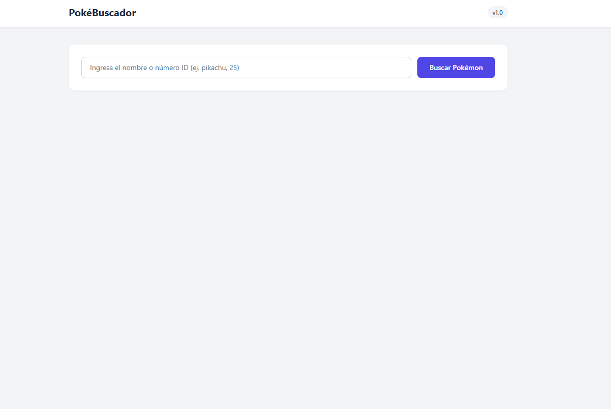
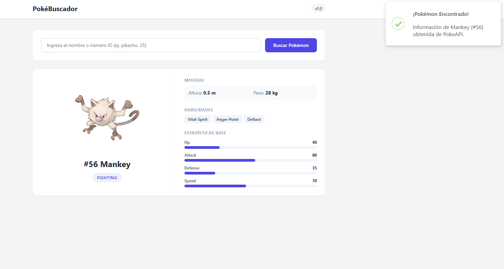
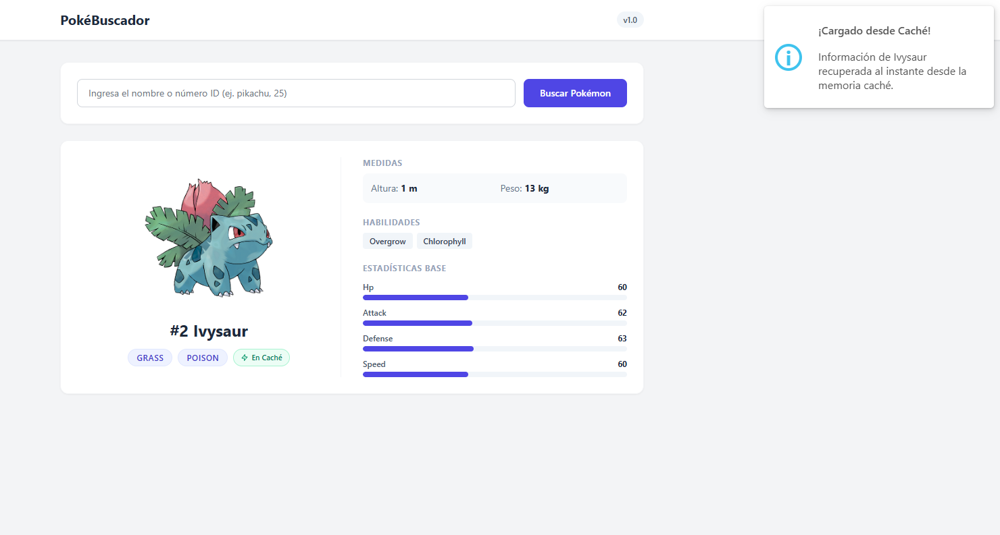
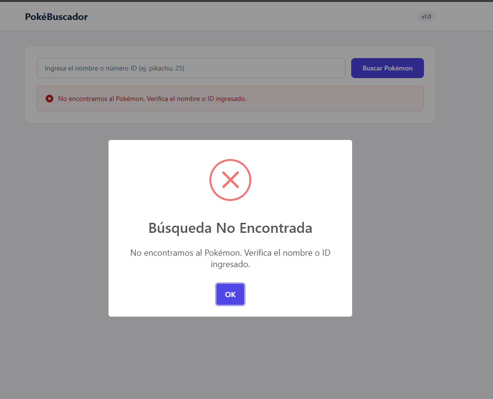
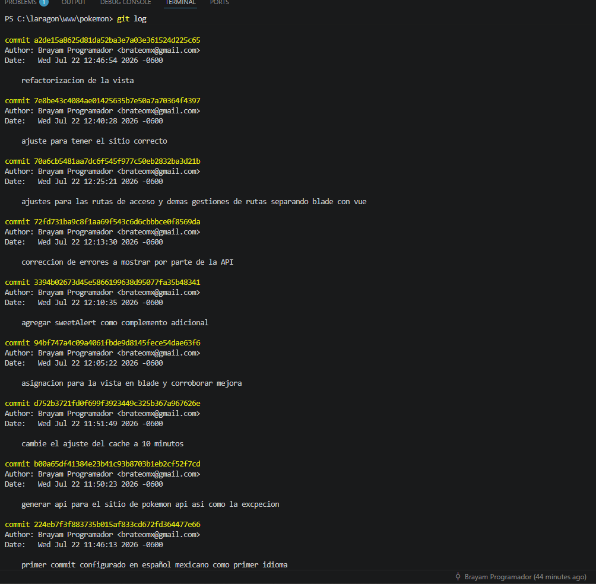

# PokéBuscador — Prueba Técnica Laravel

Buscador interactivo de Pokémon desarrollado en Laravel para la prueba técnica. Consume la **PokéAPI** oficial de manera limpia mediante el facade nativo `Http` de Laravel, implementa almacenamiento en **Caché por 10 minutos** y registra un historial de búsquedas en la base de datos con SQLite.

---

## 🛠️ Stack Tecnológico y Versiones

- **Versión de PHP:** `8.2.29`
- **Versión de Laravel:** `12.64.0`
- **Base de Datos:** MySQL (`3.45.1`)
- **Estilos UI:** Tailwind CSS (`v4`) / Vanilla CSS
- **Notificaciones Frontend:** SweetAlert2 (`v11.26.25`)

---

## 🚀 Instrucciones para Ejecutar el Proyecto

Sigue los siguientes pasos para clonar e iniciar el proyecto en tu entorno local:

### 1. Clonar el repositorio e ingresar al directorio
```bash
git clone <URL_DEL_REPOSITO>
cd pokemon
```

### 2. Instalar dependencias de PHP y Node.js
```bash
composer install
npm install
```

### 3. Configurar el archivo de entorno (`.env`)
Copia el archivo de ejemplo `.env.example` a `.env`:
```bash
cp .env.example .env
```
*(Asegúrate de que `DB_CONNECTION=sqlite` esté configurado en tu `.env`).*

### 4. Generar la clave de la aplicación y ejecutar migraciones
```bash
php artisan key:generate
php artisan migrate
```

### 5. Compilar los assets del frontend e iniciar el servidor local
```bash
npm run build
php artisan serve
```

Accede desde tu navegador a `http://127.0.0.1:8000` o `http://pokemon.test`.

---

## 📸 Demostración y Capturas de Pantalla

### 1. Vista Inicial de la Aplicación
Interfaz limpia e interactiva preparada para recibir el nombre o número de ID del Pokémon.


---

### 2. Búsqueda Correcta y Exitosa (Obtenida desde PokéAPI)
Muestra la tarjeta del Pokémon con su sprite oficial, ID, tipos, medidas, habilidades y barra de estadísticas base, acompañada de un Toast de éxito.


---

### 3. Búsqueda desde Memoria Caché (Almacenamiento de 10 min)
Cuando la información ya ha sido consultada previamente, la aplicación responde al instante desde la caché, mostrando la insignia ⚡ **En Caché** y un aviso de recuperación en memoria.


---

### 4. Búsqueda Inválida o Pokémon No Encontrado
Mapeo limpio de la excepción `PokemonNotFoundException` atrapando el error 404 de la API y mostrando un modal amigable para el usuario.


---

### 5. Historial de Commits (Log)
Historial organizado de cambios y evolución del desarrollo.

